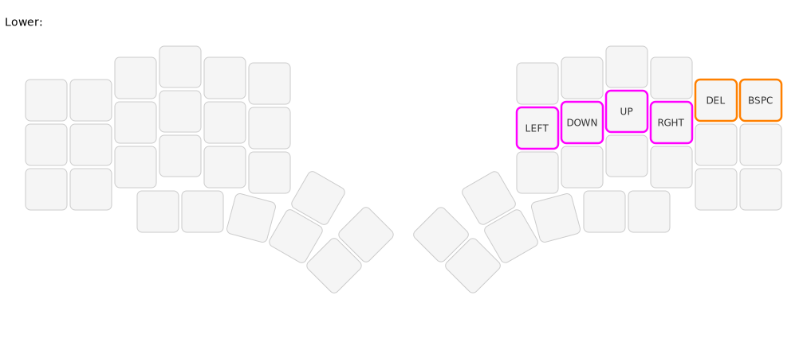
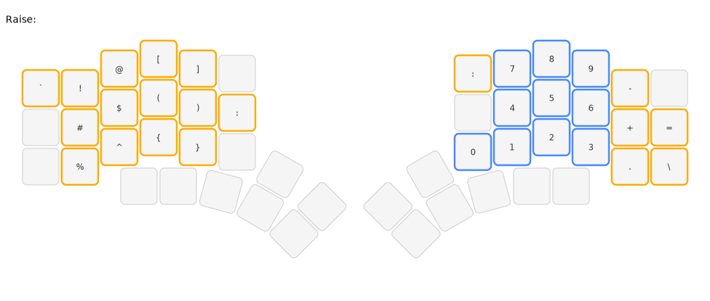
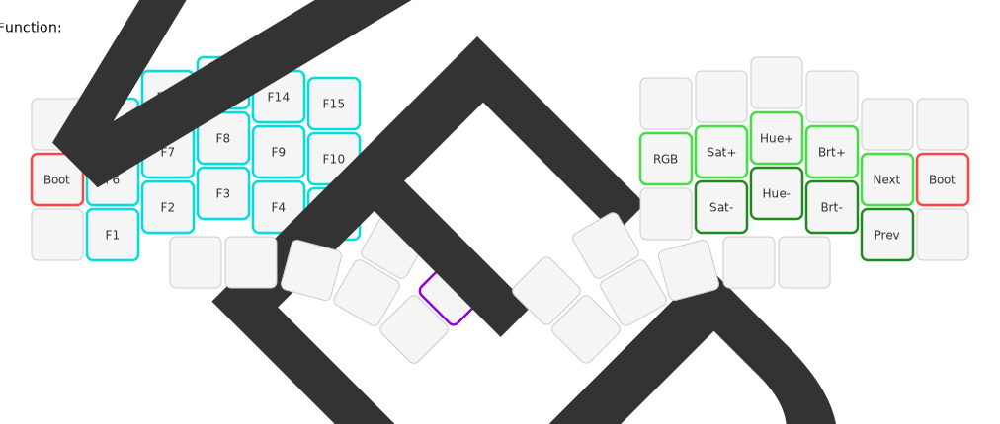
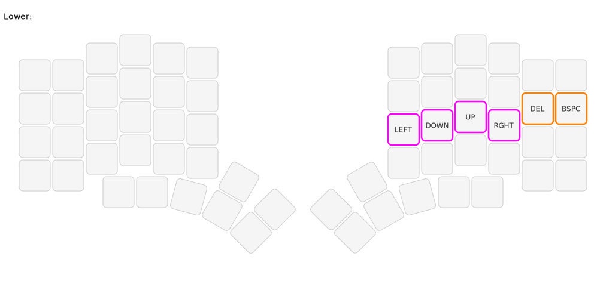
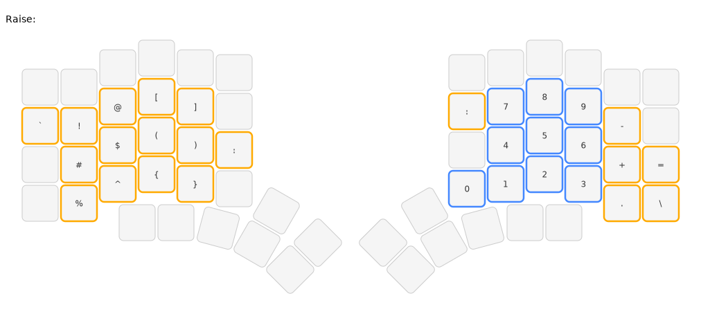
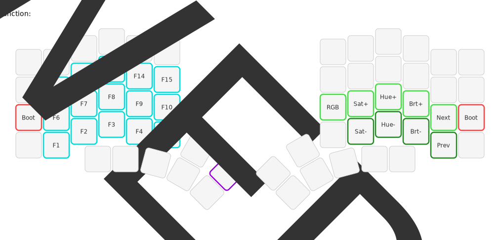
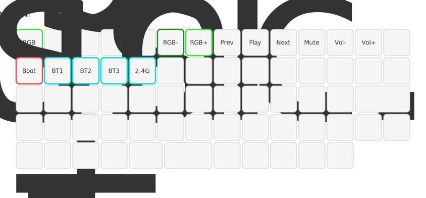
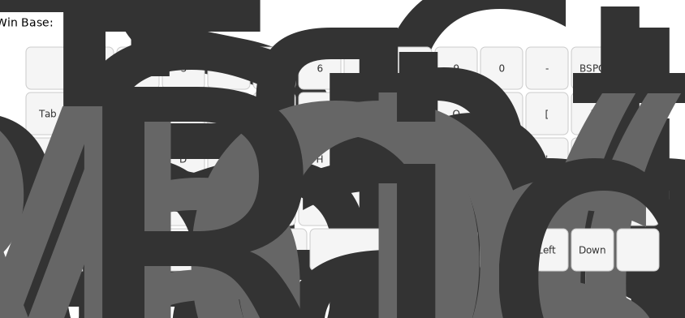
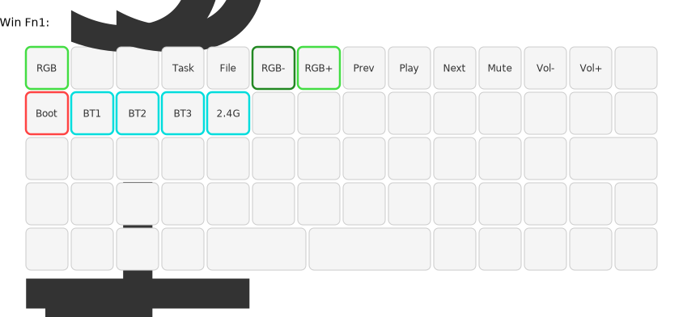
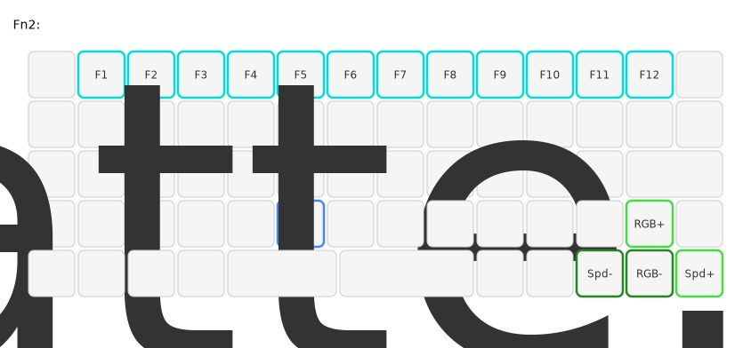

# QMK Userspace

Personal QMK firmware for three keyboards:
- **Kyria Rev4** (Halcyon series) - Split ergonomic with Colemak-DH
- **Elora Rev2** (Halcyon series) - Split ergonomic with Colemak-DH + number row
- **Keychron Q15 Max** - Ortholinear with Bluetooth/2.4GHz wireless

## Kyria Rev4 (Halcyon)

Split ergonomic keyboard with asymmetric modules:
- **Left half**: Cirque trackpad
- **Right half**: Encoder module

### Flashing

Each half must be flashed separately:

1. Enter bootloader: **Fn + Esc** (left) or **Fn + '** (right)
2. Run `./docker-build.sh flash-left` or `./docker-build.sh flash-right`
3. Or copy the `.uf2` file to the mounted `RPI-RP2` drive

### Keymap

4-layer Colemak-DH layout with per-layer RGB indicators.

#### Default Layer

Colemak-DH base layer with home row optimized for comfortable typing.


#### Lower Layer

Navigation with arrow keys. Highlighted keys show RGB indicators (magenta).



#### Raise Layer

Symbols and numpad. RGB indicators: blue for numbers, yellow for symbols.



#### Function Layer

F-keys, RGB controls, and bootloader. RGB indicators: cyan for F-keys, green for RGB controls, red for boot.



---

## Elora Rev2 (Halcyon)

Split ergonomic keyboard with number row:
- **Left half**: No module
- **Right half**: Encoder module

The Elora shares code with the Kyria - all layers and settings are identical except for the additional number row.

### Flashing

Each half must be flashed separately:

1. Enter bootloader: **Fn + Esc** (left) or **Fn + '** (right)
2. Run `./docker-build.sh flash-elora-left` or `./docker-build.sh flash-elora-right`
3. Or copy the `.uf2` file to the mounted `RPI-RP2` drive

### Keymap

4-layer Colemak-DH layout with number row and per-layer RGB indicators.

#### Default Layer

Colemak-DH base layer with number row (`~ 1 2 3 4 5 | 6 7 8 9 0 -`).


#### Lower Layer

Navigation with arrow keys. Number row is transparent.



#### Raise Layer

Symbols and numpad. Number row is transparent (direct access to base layer numbers).



#### Function Layer

F-keys, RGB controls, and bootloader. Number row is transparent.



---

## Keychron Q15 Max

Ortholinear keyboard with:
- 64 keys + 2 rotary encoders
- Bluetooth 5.1 (3 devices) + 2.4GHz wireless

### Flashing

The Q15 Max uses DFU mode:

1. Enter DFU: **Fn + Tab** (or hold Esc while plugging in)
2. Run `./docker-build.sh flash-q15`

### Keymap

5-layer QWERTY layout with separate Mac/Windows base layers.

#### Mac Base Layer


#### Mac Fn1 Layer

Media controls, RGB, and Bluetooth device switching.



#### Windows Base Layer



#### Windows Fn1 Layer



#### Fn2 Layer (Common)

F-keys and battery level indicator.



---

## Build Commands

All builds use Docker - no local QMK installation required.

### Kyria Rev4

```bash
./docker-build.sh kyria-left         # Build left half (Cirque trackpad)
./docker-build.sh kyria-right        # Build right half (encoder)
./docker-build.sh kyria-all          # Build both halves
./docker-build.sh flash-kyria-left   # Build and flash left half
./docker-build.sh flash-kyria-right  # Build and flash right half
```

### Elora Rev2

```bash
./docker-build.sh elora-left         # Build left half (no module)
./docker-build.sh elora-right        # Build right half (encoder)
./docker-build.sh elora-all          # Build both halves
./docker-build.sh flash-elora-left   # Build and flash left half
./docker-build.sh flash-elora-right  # Build and flash right half
```

### Keychron Q15 Max

```bash
./docker-build.sh q15          # Build Q15 Max firmware
./docker-build.sh flash-q15    # Build and flash Q15 Max
```

### Common

```bash
./docker-build.sh clean        # Remove build artifacts
./draw-keymap.sh               # Regenerate keymap SVGs
```

---

## Attribution

This repository contains files from [splitkb/qmk_userspace](https://github.com/splitkb/qmk_userspace) (halcyon-qmk branch).

### Copied Files

The following files were copied from splitkb/qmk_userspace:

| Path | Description |
|------|-------------|
| `LICENSE` | GPL v2 license |
| `keyboards/splitkb/halcyon/kyria/` | Kyria Rev4 Halcyon keyboard definition |
| `keyboards/splitkb/halcyon/elora/` | Elora Rev2 Halcyon keyboard definition |
| `users/halcyon_modules/` | Halcyon module support code (Cirque, encoder, display) |
| `.github/workflows/build_binaries.yaml` | GitHub Actions build workflow |

## License

This project is licensed under the GNU General Public License v2.0 - see the [LICENSE](LICENSE) file for details.

The Halcyon keyboard definitions and module support code are copyright splitkb.com and licensed under GPL-2.0-or-later.
