# QMK Userspace

Personal QMK firmware for four keyboards:

- **Kyria Rev4** (Halcyon series) - Split ergonomic with Colemak-DH
- **Elora Rev2** (Halcyon series) - Split ergonomic with Colemak-DH + number row
- **Keychron Q15 Max** - Ortholinear with Bluetooth/2.4GHz wireless
- **ZSA Planck EZ Glow** - 4x12 ortholinear with Colemak-DH

## Swift-first architecture

Swift is the only authored source of truth for keymaps, semantics, styles,
firmware configuration, companion metadata, previews, and generated diagrams.
The host compiler writes ignored QMK ABI artifacts before each build.

The module boundary is deliberate:

```text
QMKKeymapKit + QMKFirmwareRuntime
                ↓
          ObbutKeymaps
                ↓
KyriaFirmware / EloraFirmware / Q15Firmware / PlanckFirmware
                ↓
       ObbutKeyboardCatalog
                ↓
macOS + Windows companions and Xcode previews
```

`QMKKeymapKit` has no Obbut-specific vocabulary. `ObbutKeymaps` owns the shared
Obbut semantics, named styles, and behavior. Individual firmware modules select
board composition and hardware policy only.

See [SwiftKeymaps/README.md](SwiftKeymaps/README.md) for the authored API,
result-builder keymaps, previews, custom QMK tokens, and Embedded Swift
callback bridges.

## Keymap Companion

The repository includes native companion apps that visualize all four firmware
definitions, follow a connected keyboard's layer changes in realtime, and
control supported keyboard lighting. Platform UI remains native while the
protocol-v4-only model, dynamic geometry, metadata resolution, and production
renderer are shared Swift code.

- [Keymap Companion for macOS](macOS/KeymapCompanion/README.md) uses SwiftUI and its Canvas renderer.
- [Keymap Companion for Windows](Windows/KeymapCompanion/README.md) uses native WinUI 3 and Swift 6.3.3.

## Kyria Rev4 (Halcyon)

Split ergonomic keyboard with asymmetric modules:
- **Left half**: Cirque trackpad
- **Right half**: Encoder module

### Flashing

Each half must be flashed separately:

1. Enter bootloader: **Fn + Esc** (left) or **Fn + '** (right)
2. Run `./docker-build.sh flash-left` or `./docker-build.sh flash-right`
3. Or copy the `.uf2` file to the mounted `RPI-RP2` drive

### Keymap

Six-layer Colemak-DH layout with per-layer RGB indicators and an automatic pointer layer.

#### Default Layer

Colemak-DH base layer with home row optimized for comfortable typing.

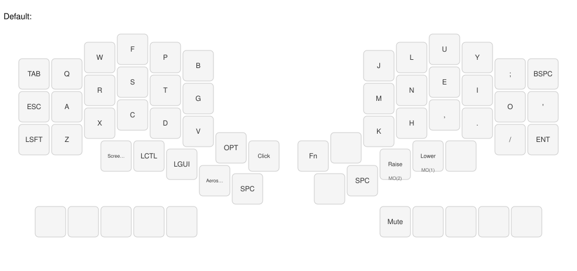

#### Lower Layer

Navigation with arrow keys. Highlighted keys show RGB indicators (magenta).

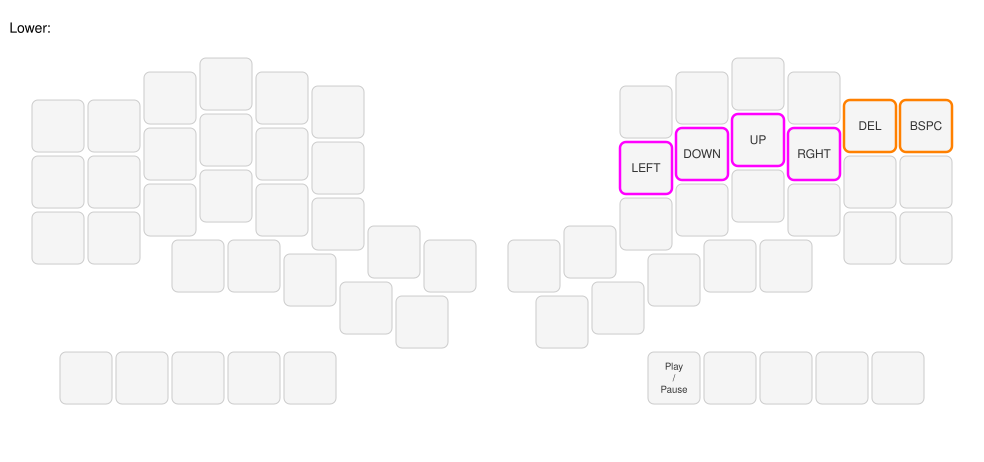

#### Raise Layer

Symbols and numpad. RGB indicators: blue for numbers, yellow for symbols.

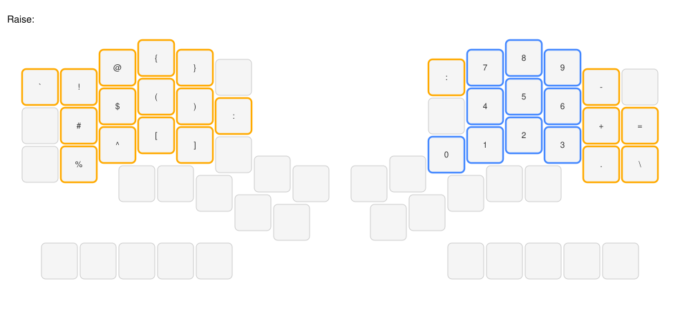

#### Function Layer

F-keys, RGB controls, and bootloader. RGB indicators: cyan for F-keys, green for RGB controls, red for boot.

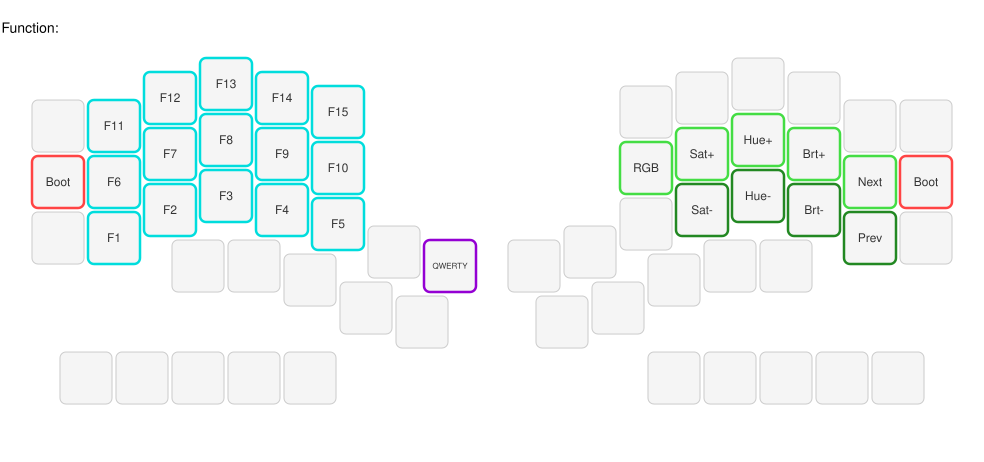

#### Pointer Layer

Touching or moving on the Cirque trackpad activates Pointer automatically. The layer remains available briefly after movement and stays active while a pointer action is held.

- `M N E I O`: Browser Back, Left Click, Right Click, Middle Click, Browser Forward
- `L` / `U`: Pointer sensitivity down/up
- `Y` / `;`: Drag-scroll speed down/up
- `H`: Hold for dominant-axis scrolling
- `,`: Hold for sniper precision
- `.`: Toggle drag lock

Pointer mode uses a dim cyan RGB underlay. Drag lock changes the underlay to red and is released by another drag-lock tap, ordinary typing, or entry into Lower, Raise, or Function. Sensitivity and scroll-speed adjustments last until reboot.

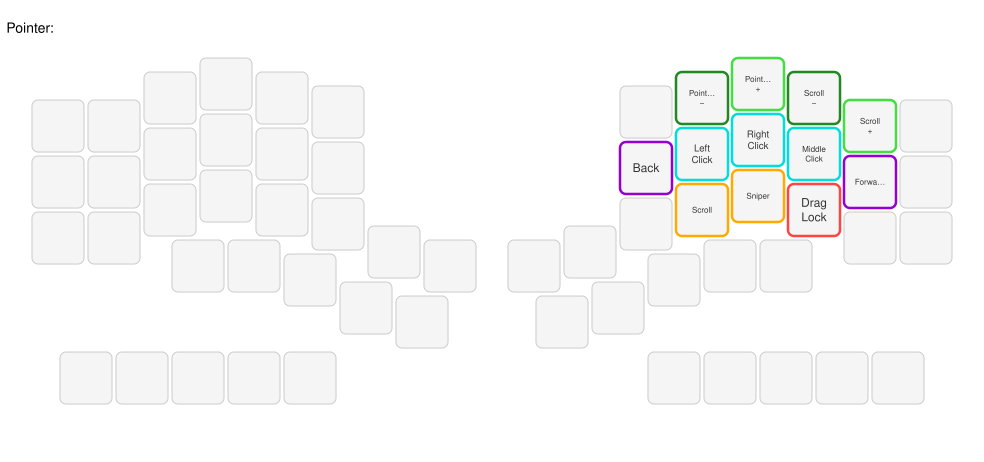

---

## Elora Rev2 (Halcyon)

Split ergonomic keyboard with number row:
- **Left half**: No module
- **Right half**: Encoder module

The Elora shares the Kyria's typing layers and settings, except for the Kyria-only automatic Pointer layer and the Elora's additional number row.

### Flashing

Each half must be flashed separately:

1. Enter bootloader: **Fn + Esc** (left) or **Fn + '** (right)
2. Run `./docker-build.sh flash-elora-left` or `./docker-build.sh flash-elora-right`
3. Or copy the `.uf2` file to the mounted `RPI-RP2` drive

### Keymap

Five-layer Colemak-DH layout with number row and per-layer RGB indicators.

#### Default Layer

Colemak-DH base layer with number row (`~ 1 2 3 4 5 | 6 7 8 9 0 -`).

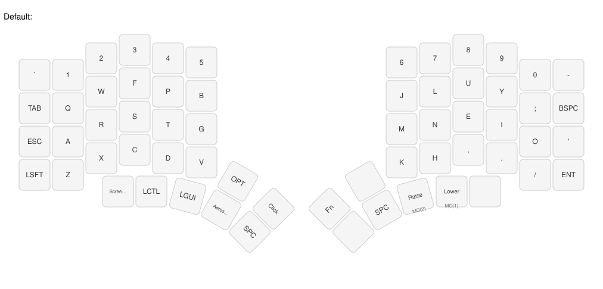

#### Lower Layer

Navigation with arrow keys. Number row is transparent.

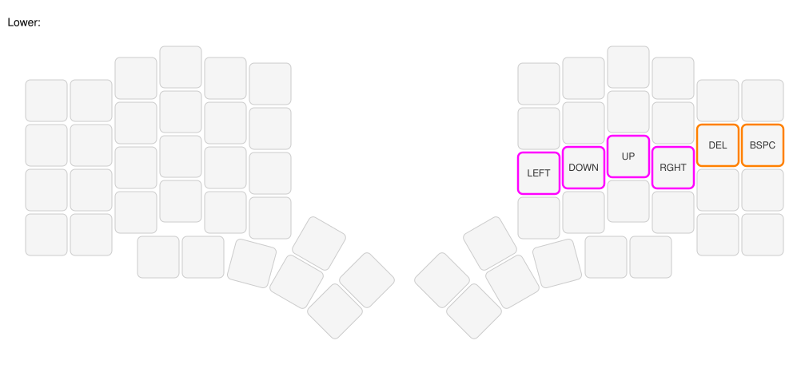

#### Raise Layer

Symbols and numpad. Number row is transparent (direct access to base layer numbers).

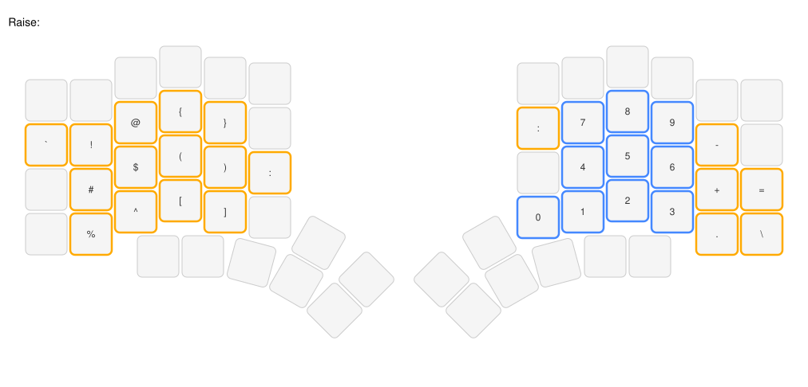

#### Function Layer

F-keys, RGB controls, and bootloader. Number row is transparent.

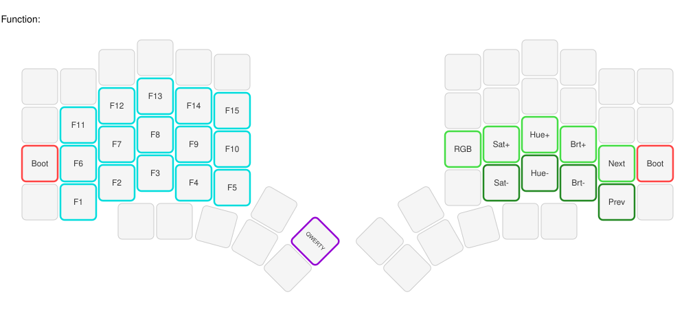

---

## Keychron Q15 Max

Ortholinear keyboard with:
- 64 keys + 2 rotary encoders
- Bluetooth 5.1 (3 devices) + 2.4GHz wireless

### Flashing

The Q15 Max uses DFU mode:

1. Enter DFU: **Fn + Tab** (or hold Esc while plugging in)
2. Run `./docker-build.sh flash-q15`

### Keymap

5-layer QWERTY layout with separate Mac/Windows base layers.

#### Mac Base Layer

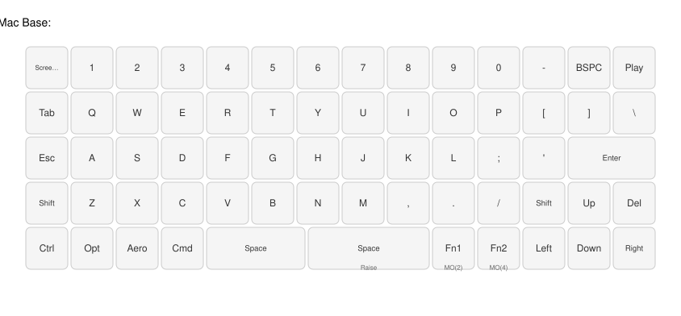

#### Mac Fn1 Layer

Media controls, RGB, and Bluetooth device switching.

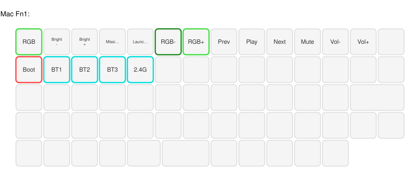

#### Windows Base Layer

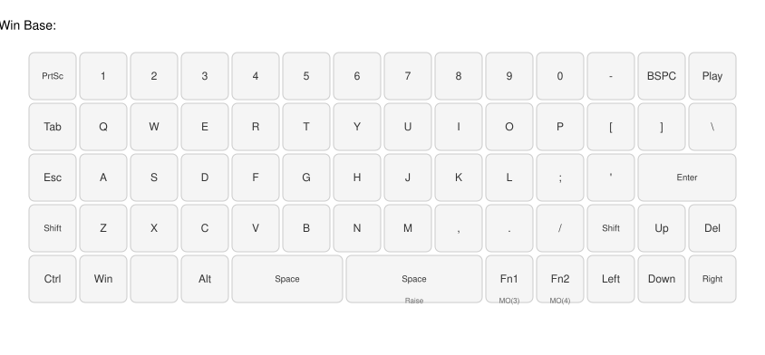

#### Windows Fn1 Layer

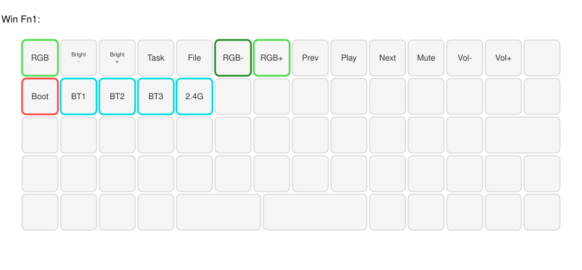

#### Fn2 Layer (Common)

F-keys and battery level indicator.

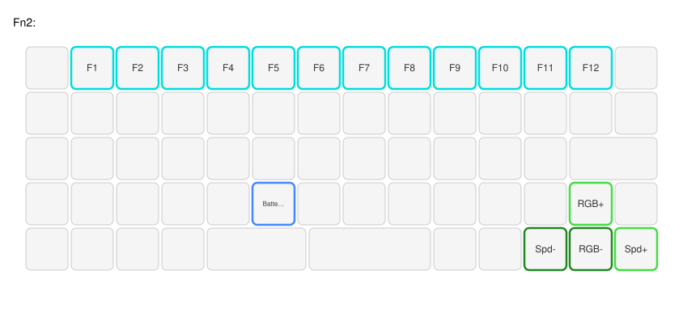

---

## ZSA Planck EZ Glow

4x12 ortholinear keyboard with per-key RGB and 2u center spacebar. Uses ZSA's QMK fork (separate Docker image).

### Flashing

The Planck EZ uses DFU mode:

1. Press the reset button on the bottom of the keyboard
2. Run `./docker-build.sh flash-planck`

### Keymap

Five-layer Colemak-DH layout matching the Kyria typing layers, with per-layer RGB indicators.

#### Default Layer

Colemak-DH base layer adapted from the Kyria.

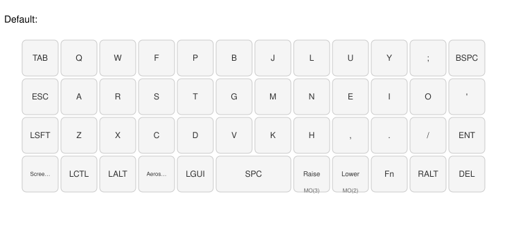

#### QWERTY Layer

Gaming layer (toggled from Function layer).

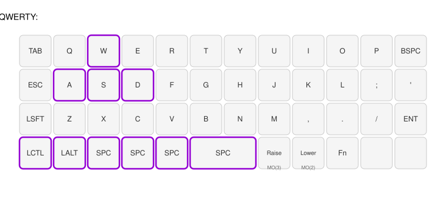

#### Lower Layer

Navigation with arrow keys.

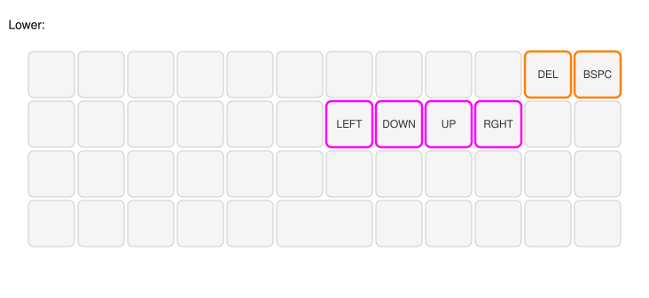

#### Raise Layer

Symbols and numpad. RGB indicators: blue for numbers, yellow for symbols.

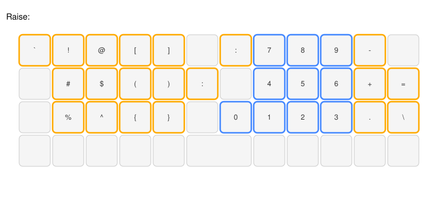

#### Function Layer

F-keys, RGB controls, and bootloader.

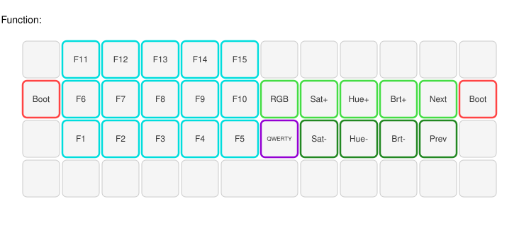

---

## Build Commands

All firmware builds use Docker. Every board compiles the same Swift protocol-v4
runtime and its selected Swift firmware modules.

### Kyria Rev4

```bash
./docker-build.sh kyria-left         # Build left half (Cirque trackpad)
./docker-build.sh kyria-right        # Build right half (encoder)
./docker-build.sh kyria-all          # Build both halves
./docker-build.sh flash-kyria-left   # Build and flash left half
./docker-build.sh flash-kyria-right  # Build and flash right half
```

### Elora Rev2

```bash
./docker-build.sh elora-left         # Build left half (no module)
./docker-build.sh elora-right        # Build right half (encoder)
./docker-build.sh elora-all          # Build both halves
./docker-build.sh flash-elora-left   # Build and flash left half
./docker-build.sh flash-elora-right  # Build and flash right half
```

### Keychron Q15 Max

```bash
./docker-build.sh q15          # Build Q15 Max firmware
./docker-build.sh flash-q15    # Build and flash Q15 Max
```

### ZSA Planck EZ Glow

```bash
./docker-build.sh planck          # Build Planck EZ Glow firmware
./docker-build.sh flash-planck    # Build and flash Planck EZ
```

### Common

```bash
./docker-build.sh clean        # Remove build artifacts
./draw-keymap.sh               # Regenerate keymap SVGs
```

---

## Attribution

This repository contains files from [splitkb/qmk_userspace](https://github.com/splitkb/qmk_userspace) (halcyon-qmk branch).

### Copied Files

The following files were copied from splitkb/qmk_userspace:

| Path | Description |
|------|-------------|
| `LICENSE` | GPL v2 license |
| `keyboards/splitkb/halcyon/kyria/` | Kyria Rev4 Halcyon keyboard definition |
| `keyboards/splitkb/halcyon/elora/` | Elora Rev2 Halcyon keyboard definition |
| `users/halcyon_modules/` | Halcyon module support code (Cirque, encoder, display) |
| `.github/workflows/build_binaries.yaml` | GitHub Actions build workflow |

## License

This project is licensed under the GNU General Public License v2.0 - see the [LICENSE](LICENSE) file for details.

The Halcyon keyboard definitions and module support code are copyright splitkb.com and licensed under GPL-2.0-or-later.
